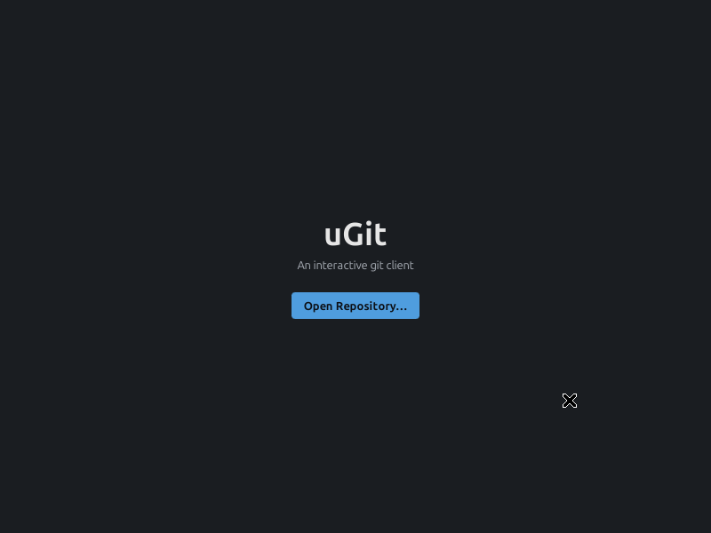
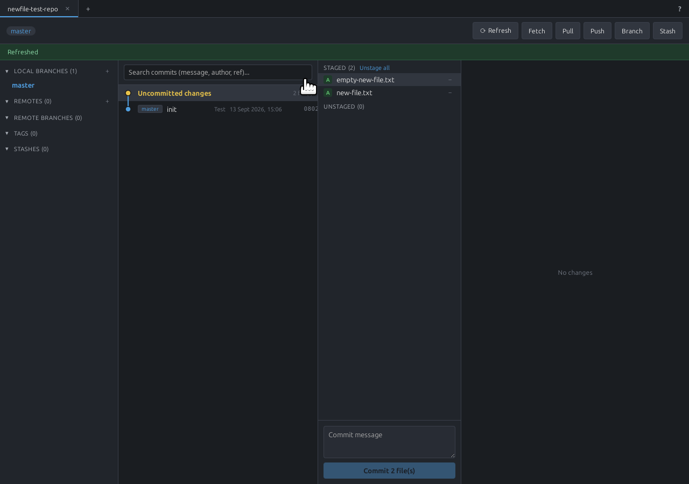
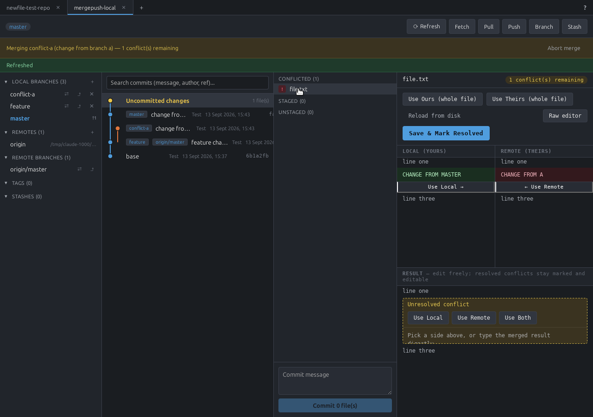
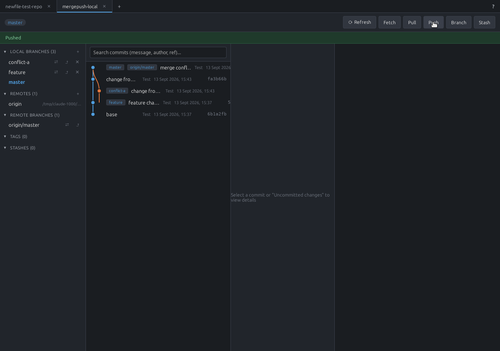

# uGit


An interactive, GitKraken-style desktop git client for Linux and Windows, built with Tauri
(Rust + `git2`) and React. It's aimed at everyday git workflows — browsing history, staging and
committing, branching, merging, and resolving conflicts — without leaving a GUI.

## Screenshots

| | |
|---|---|
|  |  |
| Open, create, or clone a repo to get started | Stage/unstage files and commit |
|  |  |
| Real 3-way merge tool for resolving conflicts | Multiple repos as tabs, with a branch/merge graph |

## Features

- **Multiple repositories at once** — each open repo gets its own tab; switching tabs is instant
  and never loses in-progress work (a draft commit message, a half-resolved merge, etc).
- **Commit graph** — a colored, lane-based visualization of history across all branches, in the
  style of `git log --graph`. Click any commit to see its changed files and diffs.
- **Commit search** — search by message, author, or branch/tag ref; shows a live match count with
  Next/Prev navigation (and highlights every match while you scroll).
- **Staging & commits** — stage/unstage individual files or everything at once, discard working
  changes, view line-by-line diffs, and commit.
- **Branching** — create, check out, and delete local and remote branches, with ahead/behind
  indicators against upstream. Clicking a branch jumps straight to its latest commit.
- **Merging & rebasing** — real merge and rebase support with conflict detection, plus a genuine
  in-app 3-way merge tool: Local and Remote reference panes on top, an editable Result pane below.
  Resolved conflicts stay clearly marked and stay editable (pick both sides and hand-tune the
  result), and long unchanged stretches of a file collapse out of the way automatically.
- **Branch reset** — soft/mixed/hard reset the current branch to any earlier commit.
- **Stashing** — save, apply, pop, and drop stashes.
- **Remotes** — add remotes, and fetch/pull/push with SSH-agent, `~/.ssh` key, and git
  credential-helper authentication, tried in that order. If an SSH remote (e.g. one set up by
  another tool like GitKraken) fails, uGit automatically retries over HTTPS using a signed-in
  GitHub account — without ever touching the repo's actual configured remote, so other tools
  reading the same repo are unaffected.
- **GitHub integration** — sign in via GitHub's Device Flow (no password ever touches uGit; the
  token is stored in the OS keychain), create a new GitHub repo and push to it in one step, and
  browse/clone your GitHub repos from the Open Repository screen. If an action needs GitHub auth
  you don't have yet, uGit prompts for it right there and retries automatically once you're
  signed in.
- **Session memory** — reopens the same tabs (and the same active tab) you had open last time,
  remembers the last folder you browsed to in the Open/New Repository dialog, and restores the
  window's size and position.
- **Built-in help** — a Help panel covering things a GUI client would otherwise leave you to figure
  out yourself: setting up SSH, creating a new local repo, linking a local repo to an existing
  remote, and creating a new remote from a local one — the last two are also real buttons, not just
  instructions.

## Development

```bash
npm install
npm run tauri dev
```

`npm run tauri` runs through `scripts/tauri-env-fix.sh`, which strips a few GTK/GDK environment
variables that a snap-packaged terminal (e.g. snap VS Code) leaks into the process. Without it,
the built binary can crash on launch with a `libpthread.so.0` symbol-lookup error. This is only
needed in that kind of terminal — it's a harmless no-op everywhere else.

## Building for Linux

```bash
npm run tauri build
```

This produces three package formats under `src-tauri/target/release/bundle/`:

| Format     | Path                                                             |
|------------|-------------------------------------------------------------------|
| `.deb`     | `deb/uGit_<version>_amd64.deb`                                     |
| `.rpm`     | `rpm/uGit-<version>-1.x86_64.rpm`                                  |
| `.AppImage`| `appimage/uGit_<version>_amd64.AppImage`                           |

The internal package name is `u-git` (Tauri normalizes `uGit` for package-manager naming rules).

### Installing on Linux

Pick whichever matches your distro:

```bash
# Debian / Ubuntu
sudo apt install ./uGit_<version>_amd64.deb

# Fedora / RHEL and derivatives
sudo dnf install ./uGit-<version>-1.x86_64.rpm

# Any distro — portable, no installation
chmod +x uGit_<version>_amd64.AppImage
./uGit_<version>_amd64.AppImage
```

Using `apt`/`dnf` to install the local file (rather than raw `dpkg -i`/`rpm -i`) gets you proper
dependency resolution and cleaner upgrades.

### Updating on Linux

Build a new bundle (bump the version in `src-tauri/tauri.conf.json` and `package.json` first) and
install it the same way:

```bash
# deb
sudo apt install ./uGit_<new-version>_amd64.deb

# rpm
sudo dnf install ./uGit-<new-version>-1.x86_64.rpm
```

Both package managers detect the existing `u-git` package and upgrade it in place — no need to
uninstall first.

For the **AppImage**, there's no package manager involved: just replace the old file with the
newly built one (same filename or not — it's just a standalone executable).

### Uninstalling on Linux

```bash
sudo apt remove u-git      # deb
sudo dnf remove u-git      # rpm
rm uGit_<version>_amd64.AppImage   # AppImage — just delete the file
```

## Building for Windows (cross-compiled from Linux)

uGit can be cross-compiled for Windows from this Linux machine, but it needs some one-time setup
beyond plain `rustup`, because the default `x86_64-pc-windows-gnu` target's linker (GNU `ld`) hits
a hard PE/COFF format limit (65535 exported symbols max) on a dependency tree this size.
`x86_64-pc-windows-gnullvm`, which links with LLVM's `lld` instead, does not have that problem.

One-time setup:

```bash
rustup target add x86_64-pc-windows-gnullvm
```

Download the [llvm-mingw](https://github.com/mstorsjo/llvm-mingw) toolchain (UCRT build, matches
`gnullvm`) and extract it somewhere reusable, e.g. `~/toolchains/`:

```bash
curl -sL -o llvm-mingw.tar.xz \
  https://github.com/mstorsjo/llvm-mingw/releases/latest/download/llvm-mingw-<version>-ucrt-ubuntu-22.04-x86_64.tar.xz
mkdir -p ~/toolchains
tar -xf llvm-mingw.tar.xz -C ~/toolchains/
```

`src-tauri/.cargo/config.toml` already points the `x86_64-pc-windows-gnullvm` target at that
toolchain's linker/ar — update the path there if you extract it somewhere other than
`~/toolchains/llvm-mingw-*-ucrt-ubuntu-22.04-x86_64/`. This config only applies to that one
target triple; it has no effect on the normal Linux build.

First, build the frontend (this path calls `cargo` directly rather than going through
`npm run tauri build`, so nothing runs it for you):

```bash
npm run build
```

Then build:

```bash
cd src-tauri
TC=~/toolchains/llvm-mingw-*-ucrt-ubuntu-22.04-x86_64
PATH="$TC/bin:$PATH" cargo build --release --target x86_64-pc-windows-gnullvm --bin ugit
```

Output: `src-tauri/target/x86_64-pc-windows-gnullvm/release/ugit.exe` — a standalone,
self-contained executable (no installer is produced by this path; see below).

**Gotcha:** if you only changed frontend files (nothing under `src-tauri/src/`) since the last
Windows build, plain `cargo build` won't notice `dist/` changed and will silently skip rebuilding
— you'll get a stale `.exe` with the old UI baked in, with no warning. Force it to pick up the new
frontend with:

```bash
cargo clean -p ugit --release --target x86_64-pc-windows-gnullvm
```

before rebuilding. (The regular Linux path, `npm run tauri build`, does not have this problem — it
always runs the frontend build itself before compiling.)

Note: the library crate's `crate-type` in `src-tauri/Cargo.toml` was trimmed to
`["staticlib", "rlib"]` (dropping `"cdylib"`) to make this possible — `cdylib` is only needed for
Tauri mobile (Android/iOS) targets, which this project doesn't use, and Windows' PE export table
can't hold the symbol count a `cdylib` build of this dependency tree produces.

### Installing / updating on Windows

There's currently no installer (`.msi`/NSIS) — just the portable `ugit.exe` above. "Installing" is
copying it wherever you like; "updating" is replacing it with a newly built one. No registry
entries, shortcuts, or uninstaller are created.

**Requires Windows 11** (or an updated Windows 10) — uGit needs the Microsoft Edge WebView2
runtime to render its UI, which ships preinstalled on those. Building a proper installer that can
bootstrap WebView2 automatically for older systems is possible later via Tauri's
`bundle.windows.webviewInstallMode` config, but needs the build to run through Tauri's own bundler
with Windows-native tooling (WiX or NSIS) — not attempted yet from this Linux setup.

The produced `.exe` has not been run on an actual Windows machine — cross-compiling only verifies
it builds and links correctly, not that it behaves correctly at runtime.

## User manual

See [docs/manual.html](docs/manual.html) (or [docs/MANUAL.md](docs/MANUAL.md)) for a full walkthrough
of using uGit — staging, branching, merging and conflict resolution, remotes, GitHub sign-in, and
more.

## Changelog

See [CHANGELOG.md](CHANGELOG.md) for what's changed in each version.

## License

[GNU AGPLv3](LICENSE), with the [Commons Clause](https://commonsclause.com/) condition. In short:
the source is open, you're free to use, modify, and redistribute it, and any distributed
modifications must stay open under the same terms — but nobody may sell it or offer it as a paid
service without separate permission.
